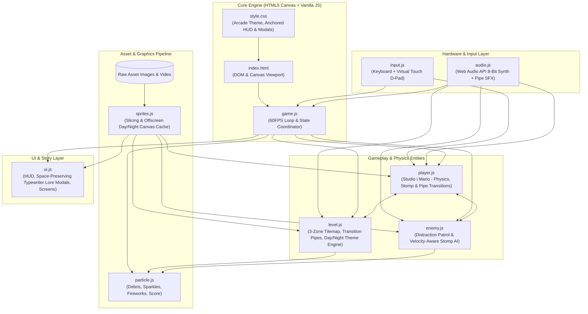
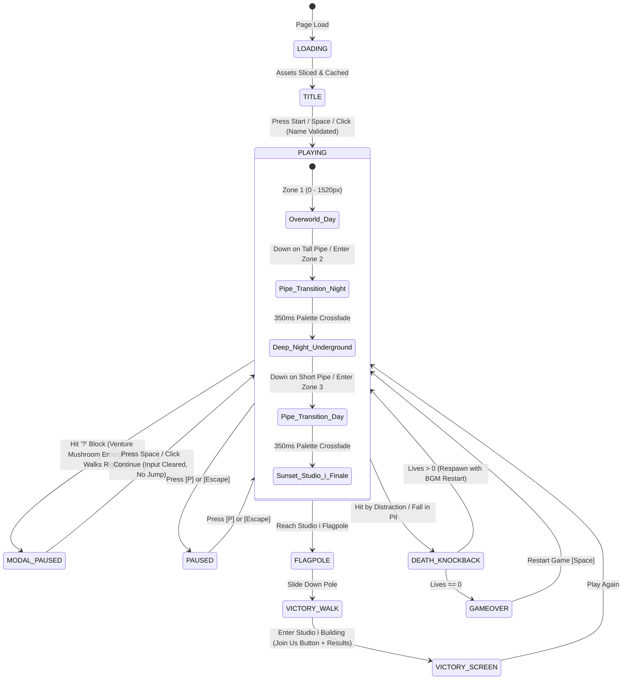
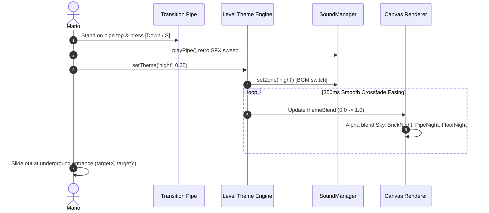
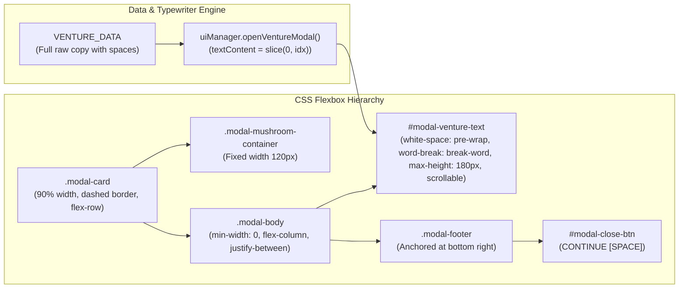

# Studio i Mario Game — Complete Project Overview & Architecture Graphs

A comprehensive visual architectural map and summary of all systems, assets, state machines, and components implemented.

---

## 1. System Architecture & Module Dependency Graph

---

## 2. Game State Machine Flowchart

---

## 3. Interactive Day ↔ Night Pipe Theme Transition Flow

---

## 4. Brand Lore Card Word-Wrap & Spacing Architecture

---

## 5. Collision & Physics Safety Matrix

| Collision Case | Root Cause / Risk | Implemented Production Fix |
| :--- | :--- | :--- |
| **Ground Horizontal Snapping** | Sub-pixel vertical dip treated ground tile as vertical wall. | Excluded `solid.type === 'ground'` from horizontal collision & added penetration threshold (`bounds.y + bounds.h > solid.y + 8`). |
| **Fast Fall Stomp Race** | High vertical speed overshoots static 24px stomp threshold. | Velocity-aware dynamic window: `enemyTop + Math.max(28, player.vy * dt)`. |
| **Mushroom Power-up Physics** | Previously static / bobbing in place. | Emerges vertically, walks continuously right at `vx = 90`, bounces on walls/pipes, falls with gravity. |
| **Modal Space Bleed** | Dismissing modal buffered Space causing instant jump. | `inputHandler.clearJustPressed()` & `player.jumpBufferTimer = 0` called inside `closeModal()`. |
| **HUD Letterboxing** | Ultrawide viewport caused HUD to float in black letterbox borders. | HUD `#hud-overlay` anchored dynamically to canvas bounding box during `resize()`. |
| **Audio Toggle Mute** | Uninitialized AudioContext crashed or muted silently. | `soundManager.init()` called before `toggleMute()`. |
