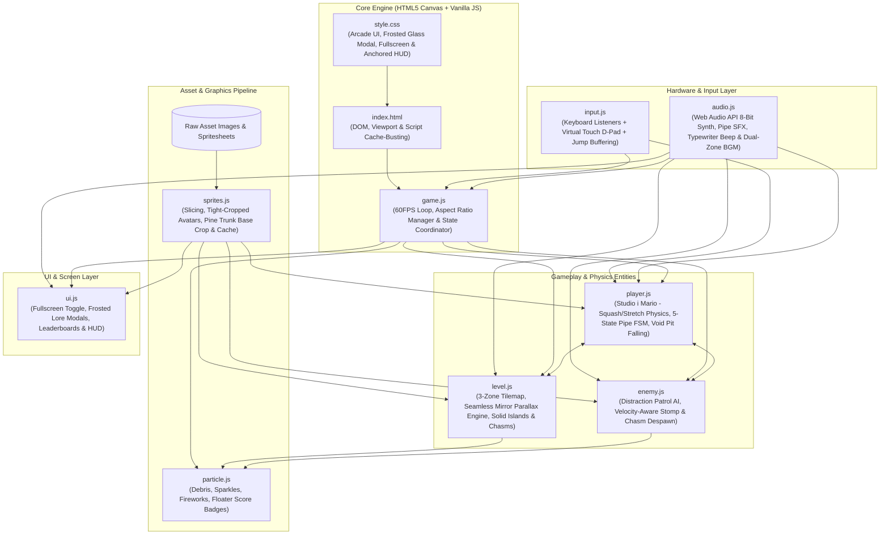
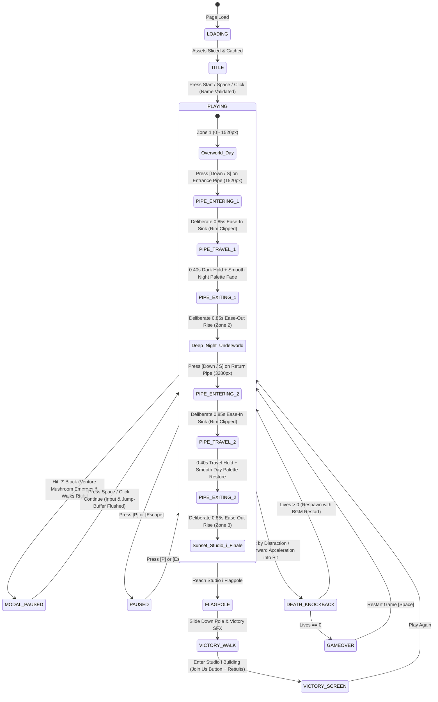
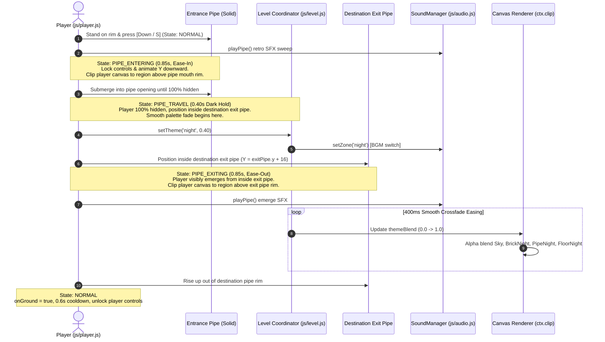
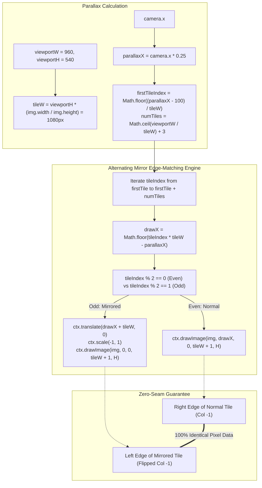
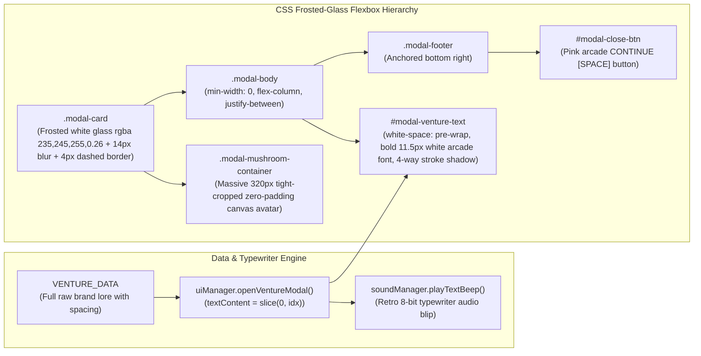

# Studio i Mario Game — Complete Project Overview & Architecture Graphs

A comprehensive visual architectural map, technical summary, state machine diagrams, and component breakdown of all systems implemented in the project.

---

## 1. System Architecture & Module Dependency Graph

---

## 2. Master Game State Machine

---

## 3. Pipe Transition Explicit State Machine & Physics Flow

---

## 4. Continuous Parallax Background Engine (Seam Elimination)

---

## 5. Venture Brand Lore Card Word-Wrap & Modal Architecture

---

## 6. Comprehensive Production Feature & Safety Matrix

| System / Feature | Root Cause / Challenge Addressed | Production Architecture & Verified Implementation |
| :--- | :--- | :--- |
| **Seamless Parallax Background** | Visible vertical seam line when tiling landscape art + sub-pixel hairline gaps. | **Alternating Horizontal Mirror Tiling**: Even tiles face forward, odd tiles face mirrored (`scale(-1,1)`). Adjacent edges share 100% identical pixel columns. Snapped to `Math.floor` with `+1px` bleed over 5200px level. |
| **Authoritative Pipe State Machine** | Previously fast 300-450ms cut with abrupt theme snapping. | **5-State Explicit FSM (`PIPE_STATE`)**: `PIPE_ENTERING` (0.85s ease-in sink with canvas rim clipping) ➔ `PIPE_TRAVEL` (0.40s dark hold with smooth palette fade) ➔ `PIPE_EXITING` (0.85s ease-out rise) ➔ `NORMAL` (0.6s cooldown, input unlocked). |
| **Venture Lore Modals** | Black box look, small avatar, overlapping text & jump bleed. | **Frosted White Glass UI**: `rgba(235,245,255,0.26)` + 14px blur + 4px dashed border. **320px massive tight-cropped mushroom avatar**, white arcade font with 4-way stroke, anchored pink `CONTINUE [SPACE]` button, typewriter audio blip, and jump-buffer flush. |
| **Open Pits / Chasms & Void Physics** | Dirt block under pine tree blocked pit visual; dying popped player 500px upward. | **Clean Trunk Base Crop**: Cropped `treePine` slice at trunk base (y=492, 172px h). Anchored trees to world ground islands. Added cliff-edge 3D shading and downward pit acceleration death (`die(true)`) with enemy despawn. |
| **Fullscreen Mode Toggle** | Canvas letterboxing broke on different aspect ratios / monitors. | Fullscreen API integration with `#app-wrapper:fullscreen` CSS & dynamic aspect-ratio preserved letterboxing in `game.resize()`. |
| **Coin Sprite Size & Clarity** | Small 32px coins with low contrast against bright sky. | Increased to 40x40px with high-res 48px offscreen canvas generator, dual-tone amber outline, specular highlights, and crisp badge text. |
| **Ground Horizontal Snapping** | Sub-pixel vertical dip treated ground tile as vertical wall. | Excluded `solid.type === 'ground'` from horizontal collision & added penetration threshold (`bounds.y + bounds.h > solid.y + 8`). |
| **Fast Fall Stomp Race** | High vertical speed overshoots static 24px stomp threshold. | Velocity-aware dynamic window: `enemyTop + Math.max(28, player.vy * dt)`. |
| **Mushroom Power-up Physics** | Previously static / bobbing in place. | Emerges vertically, walks continuously right at `vx = 90`, bounces on walls/pipes, falls with gravity. |
| **HUD Letterboxing Anchor** | Ultrawide viewport caused HUD to float in black letterbox borders. | HUD `#hud-overlay` anchored dynamically to canvas bounding box during `resize()`. |
| **Audio Toggle Mute** | Uninitialized AudioContext crashed or muted silently. | `soundManager.init()` called before `toggleMute()`. |
| **Enemy Damage Immunity in Pipes** | Enemies could collide and kill player during pipe transit. | Added `!player.isPipeTransitioning` guard to `enemy.js` collision check and `player.takeDamage()`. |
