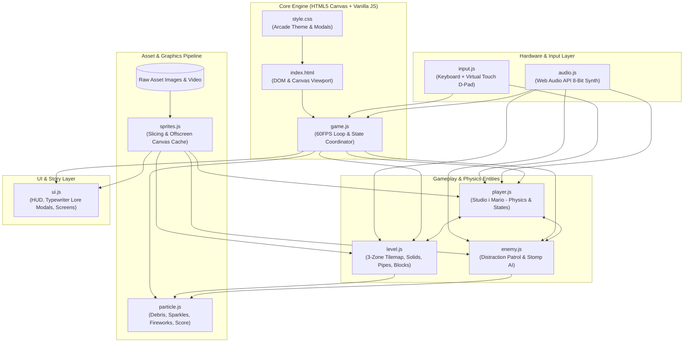
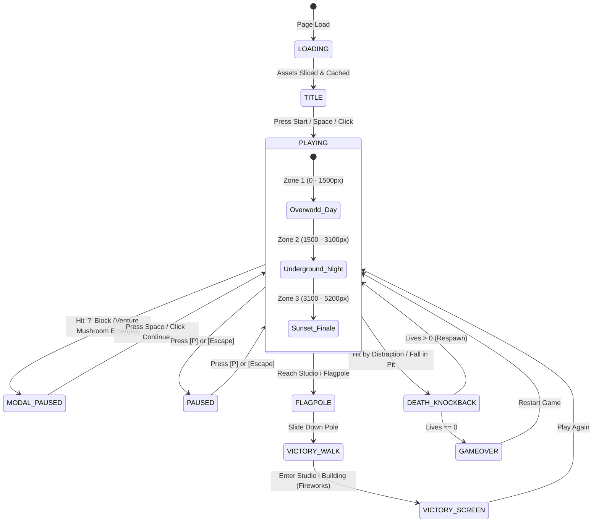
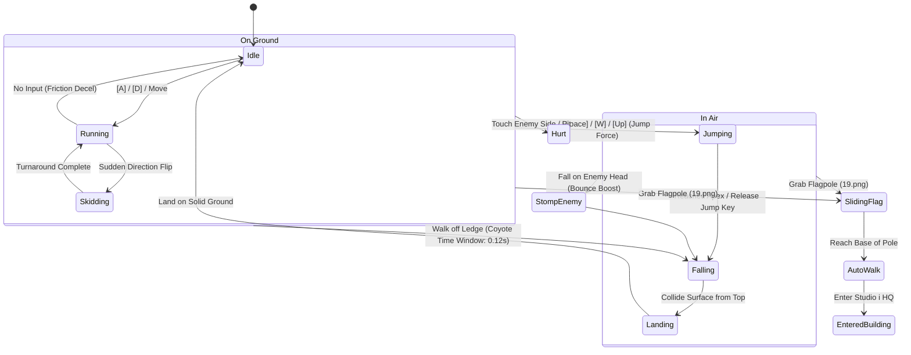
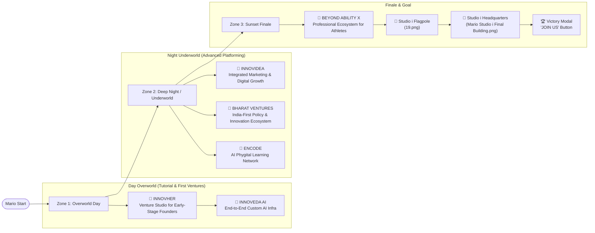

# Studio i Mario Game — Complete Project Overview & Architecture Graphs

A visual architectural map and summary of all systems, assets, state machines, and components implemented so far.

---

## 1. System Architecture & Module Dependency Graph

---

## 2. Game State Machine Flowchart

---

## 3. Player Physics & Animation State Flow

---

## 4. Venture Mushroom Lore & Startup Progression Map

---

## 5. Completed Work Matrix

| Component | Status | Summary |
| :--- | :---: | :--- |
| **Asset Analysis** | ✅ | Extracted dimensions, bounding boxes, alpha masks for all 21 files. |
| **Sprites Engine** | ✅ | Precise sprite-slicing for Mario, Distraction, bricks, question box, pipes, trees, mushrooms, flagpole, building. |
| **Player Controller** | ✅ | Variable-arc jump, coyote time, jump buffer, run cycles, skidding, hurt/death states. |
| **Enemy AI** | ✅ | Distraction Goomba with obstacle bounce patrol and stomp-squash interaction. |
| **Level Architecture** | ✅ | 5200px 3-zone connected map (Day → Night → Sunset) with parallax layers and pits. |
| **Interactive Modals** | ✅ | Dashed retro spotlight cards with animated mushrooms & typewriter narrative text. |
| **Audio Engine** | ✅ | 8-bit chiptune sound generator using Web Audio API for Day/Night BGM and SFX. |
| **Arcade HUD & UI** | ✅ | Retro score, coins counter, world tracker, timer, lives indicator, touch controls. |
| **Endgame Sequence** | ✅ | Flagpole slide down, studio entrance, fireworks celebration, and Join Us CTA button. |
